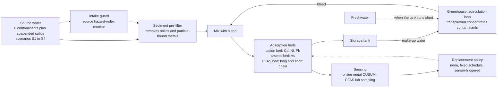
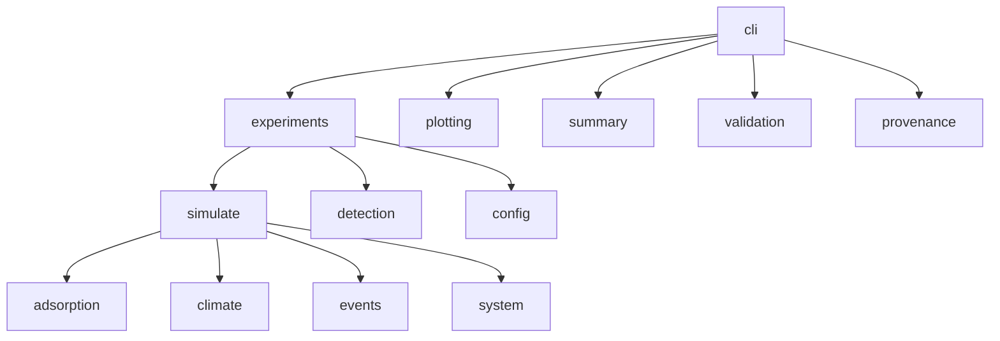

# Architecture

## System

```mermaid
flowchart LR
    SRC["Source water<br/>6 contaminants plus suspended solids<br/>scenarios S1 to S4"] --> PF["Sediment pre-filter<br/>removes solids and particle-bound metals"]
    PF --> MIX["Mix with bleed"]
    LOOP["Greenhouse recirculation loop<br/>transpiration concentrates contaminants"] -->|bleed| MIX
    MIX --> BEDS["Adsorption beds<br/>cation bed: Cd, Ni, Pb<br/>arsenic bed: As<br/>PFAS bed: long and short chain"]
    BEDS --> TANK["Storage tank"]
    TANK -->|make-up water| LOOP
    FW["Freshwater"] -.->|when the tank runs short| LOOP
    BEDS --> SENS["Sensing<br/>online metal CUSUM, PFAS lab sampling"]
    SENS --> POL["Replacement policy<br/>none, fixed schedule, sensor-triggered"]
    POL -.-> BEDS
    SRC -.-> GUARD["Intake guard<br/>source hazard-index monitor"]
    GUARD -.-> PF
```

## Module dependencies (`src/cgwn/`)

```mermaid
flowchart TD
    cli --> experiments
    cli --> plotting
    cli --> summary
    cli --> validation
    cli --> provenance
    experiments --> simulate
    experiments --> detection
    experiments --> config
    simulate --> adsorption
    simulate --> climate
    simulate --> events
    simulate --> system
```
